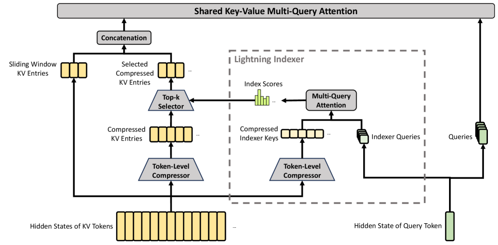

> 本文梳理 Attention、KV Cache、MLA、DSA，以及 DeepSeek-V4 中 CSA/HCA 的计算结构。重点讨论三类问题：各方法作用于特征维度还是 token 维度；Indexer 在执行全序列打分时如何降低主 Attention 成本；压缩 KV 与原始 KV 如何联合参与 Attention。

## 0. 问题分解：token 维度与特征维度

理解各种 Attention 变体之前，最重要的是区分两个轴：

| 轴 | 含义 | 典型优化方法 |
|---|---|---|
| token 维度 | 有多少历史位置需要保存、打分和读取 | Sliding Window、DSA、CSA、HCA |
| 特征维度 | 每个历史位置保存多少维 K/V，以及有多少个 KV head | MHA、GQA、MQA、MLA |

这两类优化可以组合，但解决的不是同一个问题。

- GQA、MQA、MLA 通常不会改变历史 token 数量 $L$，主要减少每个 token 的 KV 表示。
- Sliding Window、DSA、CSA、HCA 会改变每个 Query 实际访问的历史位置数量；其中 CSA/HCA 还会压缩长期 KV Cache 的 token 轴。

后文将依据这两个维度对各类方法进行分类。

一种 Attention 方法可以由以下三项量描述：

1. Query 序列长度。
2. KV Cache 中保存的条目数量。
3. 每个 Query 实际参与主 Attention 的 KV 条目数量。

下表汇总了各方法在这些维度上的差异。$W$ 表示局部窗口，$k$ 表示稀疏选择数量：

| 方法 | 长期缓存条目数 | 每个条目的表示 | 每个 Query 的主 Attention 条目数 |
|---|---:|---|---:|
| MHA/GQA/MQA | $L$ | KV head 数不同 | $L$ |
| MLA | $L$ | 低秩 latent | $L$ |
| Sliding Window | 最多 $W$ | 原始 KV | $W$ |
| DSA | $L$，另有 index cache | MLA latent | $k$ |
| CSA | 主缓存 $L/4$，另有 $L/4$ index cache | 主 KV 512 维，index key 128 维 | $k+W$ |
| HCA | $L/128$ | 共享 KV 512 维 | $L/128+W$ |

---

## 1. 标准 Attention 的计算形式

标准 Attention 中三类表示的作用为：

- Query：当前 token 用于计算相关性的表示。
- Key：各历史位置参与相关性计算的表示。
- Value：根据 Attention 权重进行聚合的表示。

对于长度为 $L$、单头维度为 $d_h$ 的一层 Attention：

$$Q\in\mathbb R^{L\times d_h},\qquad K\in\mathbb R^{L\times d_h},\qquad V\in\mathbb R^{L\times d_v}$$

计算过程是：

$$P=\operatorname{softmax}\left(\frac{QK^\mathsf T}{\sqrt{d_h}}+M\right)$$

$$O=PV$$

其中 $M$ 是因果 mask，禁止当前位置看到未来 token。

维度上：

$$\underbrace{[L,L]}_{P} \times \underbrace{[L,d_v]}_{V} = \underbrace{[L,d_v]}_{O}$$

Attention map 的两个轴不是一回事：

- 行是 Query 数量，决定输出有多少个 token。
- 列是参与计算的 Key/Value 条目数量。

因此，压缩 Key/Value 的序列轴只会改变 Attention map 的列数。只要 Query 序列长度仍为 $L$，输出序列长度就仍为 $L$。

---

## 2. KV Cache 的缓存内容与规模

### 2.1 Prefill 与 Decode

大模型推理通常分两段：

1. **Prefill**：一次处理整段输入，生成每一层的历史 K/V。
2. **Decode**：每次只生成一个新 token。

在 Decode 的第 $t$ 步，旧 token 的 K/V 不会随新 Query 改变，因此没有必要重复计算。模型把它们保存下来：

$$K_{\text{cache}}=[k_0,k_1,\ldots,k_{t-1}], \qquad V_{\text{cache}}=[v_0,v_1,\ldots,v_{t-1}]$$

新位置只需计算 $q_t,k_t,v_t$。因果自注意力允许位置 $t$ 访问自身，因此本步实际使用的 K/V 为：

$$K_{\le t}=[K_{\text{cache}};k_t], \qquad V_{\le t}=[V_{\text{cache}};v_t]$$

$q_t$ 与 $K_{\le t}$ 计算 Attention 权重，再对 $V_{\le t}$ 进行加权聚合；$k_t,v_t$ 随后作为历史状态保留在缓存中。具体实现可以先写入缓存，也可以将写入与 Attention 内核融合。

Q 不需要缓存。历史位置的 Query 只用于计算对应位置的输出，不参与后续 Decode 步骤；生成位置 $t$ 时，仅当前 $Q_t$ 与截至位置 $t$ 的 K/V 参与计算。

### 2.2 KV Cache 大小

传统 Attention 每层 KV Cache 的元素数量约为：

$$2\times L\times H_{KV}\times d_h$$

其中 2 来自 K 和 V。再乘层数、batch size 和每个元素的字节数，就得到实际显存占用。

因此可以区分三类优化对象：

- 减少 $H_{KV}\times d_h$：压缩每个 token 的特征表示。
- 减少持久缓存条目数：压缩或删除历史 KV 条目。
- 减少每个 Query 的访问条目数：从缓存中稀疏选择部分 KV；这不一定改变缓存长度。

---

## 3. MHA、GQA、MQA、MLA：主要优化特征维度

### 3.1 MHA、GQA 与 MQA

假设有 $H_Q$ 个 Query heads：

| 方法 | Query heads | KV heads | 含义 |
|---|---:|---:|---|
| MHA | $H_Q$ | $H_Q$ | 每个 Q head 有独立 K/V |
| GQA | $H_Q$ | $G$ | 一组 Q heads 共享一套 K/V |
| MQA | $H_Q$ | 1 | 所有 Q heads 共享一套 K/V |

多头仍然体现在 Q 侧。即使所有 Query heads 共享同一套 KV，不同的 $q_h$ 也会产生不同分数：

$$q_1^\mathsf Tk_s\ne q_2^\mathsf Tk_s$$

所以不同 head 仍然可以关注不同关系。

### 3.2 几个具体模型的维度

以下矩阵采用 PyTorch 的 `[out_features, in_features]` 记法。

| 模型 | 类型 | $d_{model}$ | $H_Q$ | $H_{KV}$ | $d_h$ | 每 token 每层 KV 元素数 |
|---|---|---:|---:|---:|---:|---:|
| GPT-2 Small | MHA | 768 | 12 | 12 | 64 | $2\times12\times64=1536$ |
| Qwen2.5-7B | GQA | 3584 | 28 | 4 | 128 | $2\times4\times128=1024$ |
| Falcon-7B | MQA | 4544 | 71 | 1 | 64 | $2\times1\times64=128$ |

对应投影矩阵的形状为：

```text
GPT-2 Small
WQ, WK, WV: [768, 768]

Qwen2.5-7B
WQ: [3584, 3584]
WK: [512, 3584]
WV: [512, 3584]

Falcon-7B
WQ: [4544, 4544]
WK: [64, 4544]
WV: [64, 4544]
```

这些方法不改变 KV 的 token 轴长度：序列长度为 100 万时，仍然有 100 万个 KV 位置，但每个位置保存的特征数量更少。

### 3.3 MLA：联合压缩 K/V 特征

DeepSeek-V2/V3 的 Multi-head Latent Attention（MLA）不再为每个 KV head 保存完整 K/V，而是把它们联合压缩成一个低维 latent：

$$c_t^{KV}=h_tW^{DKV}$$

计算 Attention 时，再通过上投影映射为各 head 使用的 K/V 表示。

以 DeepSeek-V3 为例：

```text
隐藏维度                         7168
Query low-rank rank             1536
KV latent rank                   512
每个 head 的 content-key 维度    128
每个 head 的 RoPE-key 维度         64
每个 head 的 value 维度           128
Query heads                       128
```

[DeepSeek-V3 官方配置][v3-config] 中与 MLA 直接相关的字段如下：

```json
{
  "hidden_size": 7168,
  "num_attention_heads": 128,
  "q_lora_rank": 1536,
  "kv_lora_rank": 512,
  "qk_nope_head_dim": 128,
  "qk_rope_head_dim": 64,
  "v_head_dim": 128
}
```

MLA 实际缓存：

$$\underbrace{c_t^{KV}}_{512} + \underbrace{k_t^R}_{64} =576\text{ 个元素/token/layer}$$

若使用等价的完整 MHA，需要：

$$128\times(128+64+128)=40960$$

所以特征缓存约缩小 $40960/576\approx71$ 倍。

但要注意：MLA 仍然保存 $L$ 个 latent。它主要压缩特征轴，不压缩 token 轴。

### 3.4 MLA 的展开方式与计算成本

MLA 最确定的收益是 KV Cache 容量和 Decode 访存带宽。

如果显式地将 latent 展开成完整 K/V 后再执行普通 Attention，核心 token-pair 数量不会减少，并且会增加展开操作。高效实现利用结合律，将上投影吸收到 Query 和输出投影中，例如：

$$q^\mathsf T(W^{UK}c) = ((W^{UK})^\mathsf Tq)^\mathsf Tc$$

这样无需为全部历史 token 显式展开 K。不过 $L$ 个历史位置仍然都要参与，因此 MLA 本身没有解决长上下文的 token 维度问题。

---

## 4. RoPE：让 QK 点积感知相对位置

### 4.1 RoPE 的旋转计算

RoPE 把相邻两个特征维度视为一个二维向量。对位置 $p$ 和第 $i$ 个二维对子，旋转角度为：

$$\theta_{p,i}=p\cdot\omega_i, \qquad \omega_i=\Theta^{-2i/d_{rope}}$$

二维旋转为：

$$\begin{bmatrix} x'_{2i}\\ x'_{2i+1} \end{bmatrix} = \begin{bmatrix} \cos\theta_{p,i} & -\sin\theta_{p,i}\\ \sin\theta_{p,i} & \cos\theta_{p,i} \end{bmatrix} \begin{bmatrix} x_{2i}\\ x_{2i+1} \end{bmatrix}$$

记位置 $p$ 的整体旋转矩阵为 $R_p$。对 Q、K 分别旋转：

$$q'_t=R_tq_t,\qquad k'_s=R_sk_s$$

它们的点积满足：

$$(q'_t)^\mathsf Tk'_s =q_t^\mathsf TR_t^\mathsf TR_sk_s =q_t^\mathsf TR_{s-t}k_s$$

因此绝对位置 $s,t$ 被转化成了相对距离 $s-t$。

### 4.2 RoPE 在 Q/K 上的作用与 V 的坐标一致性

Q、K 直接决定 Attention logits，因此在这两个表示上引入位置变换，可以使权重计算依赖相对位置。V 只参与权重确定后的聚合，通常保持在统一的特征坐标系中：

$$o_t=\sum_s\alpha_{t,s}v_s$$

如果直接对 V 做绝对位置旋转：

$$o_t=\sum_s\alpha_{t,s}R_sv_s$$

来自不同位置的 Value 会处在不同的旋转坐标系中。即使其未旋转表示相同，旋转后的分量也可能在加权求和时发生抵消。因此标准 Attention 通常不旋转 V。

这并不表示 V 不能使用位置变换，而是需要额外操作将聚合结果转换到一致的坐标系。DeepSeek-V4 通过输出端的逆 RoPE 处理这一问题。

---

## 5. Sparse Attention 的计算动机

即使使用 GQA、MQA 或 MLA，只要每个 Query 仍然访问全部历史位置，长上下文计算量仍然较高。

对于长度 $L$：

- Prefill 的 Dense Attention token-pair 数量约为 $O(L^2)$。
- Decode 每生成一个 token，需要访问 $O(L)$ 个历史位置。
- KV Cache 的 token 轴仍然为 $O(L)$。

Sparse Attention 的目标是让主 Attention 只访问一个较小集合：

$$\mathcal S_t\subseteq\{0,1,\ldots,t\}, \qquad |\mathcal S_t|\ll t$$

### 5.1 Sliding Window Attention

最直接的方法是只保留最近 $W$ 个 token：

$$\mathcal S_t=\{t-W+1,\ldots,t\}$$

单层只能传播 $W$ 范围的信息，但多层堆叠可以扩大理论感受野。如果每层最多向前传播 $W-1$ 步，堆叠 $N$ 层后：

$$\text{感受野}\approx1+N(W-1)$$

第 2 层读取的局部隐藏状态已经包含第 1 层聚合的信息，因此信息可以通过多层局部 Attention 跨越更长的历史距离传递至当前位置。

但理论可达范围不等价于对长距离位置的直接访问。多层传播路径会增加信息损失，因此长上下文模型通常还需要显式的长距离 Attention 机制。

### 5.2 Attention 与残差连接的作用

Attention 在同一层内聚合不同 token 的表示；残差连接则在层间保留同一 token 的已有表示。二者分别对应序列维度上的信息交互和网络深度方向上的状态传递。

标准残差形式为：

$$h_t^{(l+1)}=h_t^{(l)}+\operatorname{Attention}^{(l)}(h)_t$$

因此，Attention 输出作为增量加入原隐藏状态，而不是完全替换原隐藏状态。对于有损的 KV 压缩，这可以保留未经过当前层 Attention 聚合的 token 表示。

---

## 6. DeepSeek-V3.2 DSA：低维全序列打分与稀疏主 Attention

DeepSeek Sparse Attention（DSA）使用轻量 Indexer 对全部历史位置计算相关性分数，选择 top-$k$ 位置后，主 MLA Attention 仅在选中位置上计算。

### 6.1 Indexer 打分公式

对于 Query token $t$、历史 token $s$，Indexer 使用多个轻量 query heads 和一套共享 index key：

$$I_{t,s} = \sum_{j=1}^{H_I} w^I_{t,j} \operatorname{ReLU} \left((q^I_{t,j})^\mathsf Tk^I_s\right)$$

该式包含三个步骤：

1. 各 indexer head 独立计算 Query 与共享 index key 的相关性。
2. 当前 Query 产生动态系数 $w^I_{t,j}$。
3. 对各 head 的 ReLU 分数进行加权求和，得到位置 $s$ 的标量分数 $I_{t,s}$。

随后：

$$\mathcal S_t=\operatorname{TopK}_s(I_{t,s})$$

V3.2 的主 Attention 使用 top-2048。所有主 Query heads 共享这个选中集合，但各自重新计算高维主 Attention 权重。

### 6.2 Indexer 的计算范围与成本

Indexer 对全部历史位置执行低维 QK 打分，但不构成完整的 Dense Attention。

它没有执行完整主路径中的高维多头 QK、全长度 softmax 和 Value 聚合。其计算成本可近似表示为：

$$\text{Dense Decode}: L\cdot C_M$$

$$\text{DSA Decode}: L\cdot C_I+k\cdot C_M, \qquad C_I\ll C_M,\quad k\ll L$$

因此 Decode 对 $L$ 的渐近阶没有改变，但全序列项的计算维度较低，高维主 Attention 只处理 $k$ 个位置。

忽略常数项后，Prefill 可以近似写成：

$$\text{Dense Prefill}: L^2C_M$$

$$\text{DSA Prefill}: L^2C_I+LkC_M$$

因此 DSA 的 Prefill 在渐近意义上仍有平方项，但该平方项对应计算成本较低的 Indexer。

### 6.3 DSA 的 KV Cache 长度

DSA 不压缩主 MLA Cache 的 token 轴。V3.2 的主 MLA Cache 仍然有 $L$ 个位置，并且还增加了一份低维 index key cache。

DSA 的主要收益是：

- 将主 Attention 读取的历史 KV 数量从 $L$ 降至 $k$。
- 将主路径中的高维计算限制在选中位置。
- 降低 Decode 阶段的显存带宽需求。

但它没有从根本上把长期 KV Cache 从 $L$ 压成 $L/4$ 或 $L/128$。这正是 DeepSeek-V4 继续改进的方向。

---

## 7. DeepSeek-V4：CSA 与 HCA 的混合 Attention

DeepSeek-V4 先在 token 轴上压缩长期 KV，再对压缩表示执行稀疏或稠密 Attention。[DeepSeek-V4 技术报告][v4-report]

两种层交错出现：

- CSA：Compressed Sparse Attention，以 $4:1$ 压缩长期 KV 后执行稀疏选择。
- HCA：Heavily Compressed Attention，以 $128:1$ 压缩长期 KV 后执行稠密 Attention。

二者共同使用：

- 多头低秩 Query。
- 共享 Key-Value MQA，即 $K=V=C$。
- 最近 128 个原始 token 的滑动窗口。
- 末尾 64 维的 Partial RoPE。
- Attention 输出的逆 RoPE。
- 分组低秩输出投影。
- Attention sink。


*图 1：DeepSeek-V4 总体架构。原图为 DeepSeek-V4 Tech Report Figure 2；Attention 层交错使用 CSA 与 HCA。来源：[DeepSeek-V4 Technical Report][v4-report]。*

下面截取 [DeepSeek-V4-Pro 官方 config][v4-config] 中与 Attention 直接相关的字段。压缩层序列只展示前几项：

```jsonc
{
  "dim": 7168,
  "n_heads": 128,

  "q_lora_rank": 1536,
  "head_dim": 512,
  "rope_head_dim": 64,

  "o_groups": 16,
  "o_lora_rank": 1024,
  "window_size": 128,

  "index_n_heads": 64,
  "index_head_dim": 128,
  "index_topk": 1024,

  // 仅展示前 6 项：128 表示 HCA，4 表示 CSA
  "compress_ratios": [128, 128, 4, 128, 4, 128]
}
```

这些字段表明：主 Query 包含 128 个 512 维 heads；长期 KV 使用单个 512 维共享表示；Indexer 使用 128 维表示。

### 7.1 V4 的 Query 投影

当前 token 的隐藏状态：

$$h_t\in\mathbb R^{7168}$$

先做低秩降维：

$$c_t^Q=\operatorname{RMSNorm}(h_tW^{DQ}) \in\mathbb R^{1536}$$

再展开为 128 个 Query heads：

$$[q_{t,1};\ldots;q_{t,128}] =c_t^QW^{UQ} \in\mathbb R^{128\times512}$$

每个 head 再做 RMS 归一化，最后 64 维应用 RoPE。

下面是根据官方 [model.py][v4-model] 主干等价化简的伪代码。它省略了张量并行、量化和 cache 管理，只保留形状变化：

```python
# x: [B, L, 7168]
q_latent = q_norm(wq_a(x))                  # [B, L, 1536]
q = wq_b(q_latent)                          # [B, L, 128 * 512]
q = q.reshape(B, L, 128, 512)
q = rms_normalize_each_head(q)
q[..., -64:] = rope(q[..., -64:], position)
```

### 7.2 CSA：每 4 个 token 产生一个重叠压缩项



*图 2：CSA 核心架构。原图为 DeepSeek-V4 Tech Report Figure 3，包含主压缩路径、Lightning Indexer、滑动窗口 KV 与共享 KV MQA。来源：[DeepSeek-V4 Technical Report][v4-report]。*

CSA 的压缩率为 $m=4$。区别于均值池化，CSA 从隐藏状态产生两套候选表示和门控分数：

$$C_j^a=h_jW^{KV,a},\qquad C_j^b=h_jW^{KV,b}$$

$$Z_j^a=h_jW^{Z,a},\qquad Z_j^b=h_jW^{Z,b}$$

第 $i$ 个压缩项结合：

- 当前块的 $C^a$。
- 前一个块的 $C^b$。

形式上：

$$C_i^{\text{Comp}} = \sum_{j=mi}^{m(i+1)-1}S_j^a\odot C_j^a + \sum_{j=m(i-1)}^{mi-1}S_j^b\odot C_j^b$$

权重在总共 $2m=8$ 个候选位置上按特征维度做 softmax，并加入可学习的块内位置偏置。第一个块没有前驱，其对应位置使用 padding 和负无穷分数。

以三个连续原始块为例：$G_0=(x_0,\ldots,x_3)$、$G_1=(x_4,\ldots,x_7)$、$G_2=(x_8,\ldots,x_{11})$。各压缩项的来源如下：

| 压缩项 | 前一块的 $C^b$ 分支 | 当前块的 $C^a$ 分支 |
|---|---|---|
| $C_0^{\text{Comp}}$ | padding | $G_0$ |
| $C_1^{\text{Comp}}$ | $G_0$ | $G_1$ |
| $C_2^{\text{Comp}}$ | $G_1$ | $G_2$ |

这里的两套 $C$ 是压缩过程中的中间表示，不是两套最终 KV Cache。最终仍然只保存：

$$C^{\text{Comp}}\in\mathbb R^{(L/4)\times512}$$

重叠压缩用于降低固定分块边界造成的信息损失。同一个 token 通过不同投影，分别参与当前压缩条目和后继压缩条目的计算。

依据论文符号，官方 Compressor 的核心逻辑可化简如下。完整实现还包含 Prefill/Decode 状态管理、量化和未完成块处理：

```python
# 每个 token 投影为两套 512 维候选和门控分数
c_a, c_b = split(wkv(x), 512)
z_a, z_b = split(wgate(x), 512)

# 第 i 个输出使用前一块 B 与当前块 A，共 8 个来源
source = concat(previous_block(c_b), current_block(c_a), dim="token")
gate = concat(previous_block(z_b), current_block(z_a), dim="token")
gate = gate + learned_position_bias

# 对每个特征维度，沿 8 个来源分别归一化
c_comp = (source * softmax(gate, dim="token")).sum(dim="token")
c_comp = rms_norm(c_comp)                   # [B, L / 4, 512]
c_comp[..., -64:] = rope(c_comp[..., -64:], block_start_position)
```

这里的 `block_start_position` 使用原始 token 坐标 $mi$，而不是压缩序列下标 $i$。

### 7.3 CSA 的 Indexer：对压缩条目进行稀疏选择

CSA 的 Indexer 沿用 DSA 的打分形式，但候选集合从 $L$ 个原始 token 变为 $L/4$ 个压缩条目。

Indexer 不直接使用主 Attention 的 512 维 $C^{\text{Comp}}$，而是从隐藏状态独立学习一套 128 维压缩 index key：

$$K^I\in\mathbb R^{(L/4)\times128}$$

同一个 Query latent $c_t^Q\in\mathbb R^{1536}$ 被投影成：

$$Q_t^I\in\mathbb R^{64\times128}$$

每个 indexer head 与全部已完成压缩条目计算点积：

$$r_{t,j,i} = \operatorname{ReLU} \left((q_{t,j}^I)^\mathsf Tk_i^I\right)$$

再用当前 Query 产生的 head 权重合并：

$$I_{t,i} = \sum_{j=1}^{64}w_{t,j}^I r_{t,j,i}$$

最后选择 top-1024 压缩条目。Indexer 仅返回位置下标，主 Attention 根据这些下标读取对应的 512 维 $C_i^{\text{Comp}}$。主压缩路径与 Indexer 压缩路径具有独立参数，二者的输出分别用于主 Attention 和位置选择。

对应的 Indexer 主干可写成：

```python
# q_index: [B, L, 64, 128]
# k_index: [B, L/4, 128]
score_per_head = einsum("blhd,btd->blht", q_index, k_index)
score_per_head = relu(score_per_head)

# 当前 token 为 64 个 indexer heads 产生动态权重
index_score = (score_per_head * head_weight[..., None]).sum(dim="head")
selected = topk(index_score, k=1024, dim="compressed_token")
```

CSA Indexer 仍然对 $L/4$ 个候选执行全长度低维打分。相较于 DSA：

- 候选数量减少至原序列的 $1/4$。
- index 特征只有 128 维并使用低精度计算。
- 不执行全长度 Value 聚合。
- 128-head、512 维主 Attention 只处理 top-1024。

从 [公开推理代码][v4-model] 看，Indexer 的 Q/K 还会先执行 Hadamard rotation，再模拟 FP4 量化；主 KV 的 448 个非 RoPE 维度使用低精度存储，而位置敏感的 64 个 RoPE 维度保留 BF16。因此，V4 同时利用候选压缩和混合精度降低计算与存储成本。

### 7.4 压缩 C 作为共享 Key/Value

主压缩项经过 RMSNorm，并在最后 64 维应用 RoPE。随后不再分别展开 K 和 V，而是直接令：

$$K_i=V_i=C_i^{\text{Comp}}$$

对于主 Query head $a$：

$$z_{t,a,i} = \frac{q_{t,a}^\mathsf TC_i^{\text{Comp}}}{\sqrt{512}}$$

$$o_{t,a} = \sum_i\operatorname{softmax}_i(z_{t,a,i})C_i^{\text{Comp}}$$

官方稀疏内核执行以下运算：

$$QC^\mathsf T \rightarrow\operatorname{softmax} \rightarrow\operatorname{softmax}(QC^\mathsf T)C$$

同一个 $C$ 在点积阶段充当 Key，在加权求和阶段充当 Value。

下面是 [官方 TileLang kernel][v4-kernel] 的数学等价简化。生产内核使用在线 softmax，不显式物化完整 Attention map：

```python
# selected_kv: 对每个 Query gather 后的 [top-k + window, 512]
logits = q @ selected_kv.transpose(-1, -2) / sqrt(512)
weights = softmax_with_attention_sink(logits)

# Value 聚合使用同一个 selected_kv
out = weights @ selected_kv
```

这里的 attention sink 是每个 head 一个可学习标量。它只在 softmax 分母中增加一项，不提供 Value：

$$\alpha_{t,h,j} = \frac{\exp(z_{t,h,j})} {\sum_k\exp(z_{t,h,k})+\exp(z'_h)}$$

该 sink 项使实际 KV 权重之和可以小于 1，从而允许 Attention 输出的幅值由模型自适应调节。

V4-Pro 得到 128 个 512 维 head 输出后，并不直接使用一个巨大的 $65536\to7168$ 投影。它把 128 个 heads 分成 16 组，每组 8 个 heads：

$$128\times512 \rightarrow 16\times4096 \rightarrow 16\times1024 \rightarrow 7168$$

中间的 $4096\to1024$ 是每组独立的低秩输出投影，对应配置中的 **o_groups=16** 和 **o_lora_rank=1024**。

### 7.5 KV 序列压缩与输出序列长度

该结构不包含序列上采样操作。被压缩的是 Key/Value 轴，而 Query 轴始终为 $L$：

$$Q\in\mathbb R^{L\times d}, \qquad K,V\in\mathbb R^{(L/4)\times d}$$

为单独说明 Query 轴与 KV 轴的维度关系，暂时忽略 causal mask、top-$k$ 和滑动窗口；若主分支对全部压缩项计算 Attention，其矩阵形状为：

$$P\in\mathbb R^{L\times(L/4)}$$

因此：

$$\underbrace{[L,L/4]}_P \times \underbrace{[L/4,d]}_V = \underbrace{[L,d]}_O$$

矩阵乘法保留 Attention map 的 Query 轴，因此输出 token 数量仍为 $L$。

CSA 实际不会计算完整主 Attention map。经过 top-$k$ 和滑动窗口后，每个 Query 的主 Attention 近似为：

$$[k+128]\times d$$

整个 Prefill 输出仍然是：

$$O\in\mathbb R^{L\times d}$$

### 7.6 原始 KV 与压缩 KV 的联合 Attention

对于 Query $t$，最终候选集合是：

$$\mathcal M_t = \underbrace{\{R_{t-127},\ldots,R_t\}}_{\text{最近原始 KV}} \cup \underbrace{\{C_{i_1}^{\text{Comp}},\ldots,C_{i_k}^{\text{Comp}}\}}_{\text{长距离压缩 KV}}$$

二者均为 512 维，并在同一个 softmax 中归一化：

$$\alpha_{t,a,j} = \operatorname{softmax}_j \left(\frac{q_{t,a}^\mathsf TM_j}{\sqrt{512}}\right)$$

两类 KV 的统计分布和位置粒度不同。V4 通过以下设计使其可以联合参与计算：

- 原始 KV 和压缩 KV 使用不同的可学习投影，两套投影在相同的 Query 分布和语言模型目标下联合训练。
- 两者都做 RMSNorm，使点积尺度可比较。
- 两者都有相同的 448 维内容通道和 64 维 RoPE 通道。
- 原始窗口保留局部 token 级信息，压缩 KV 提供长距离上下文表示。
- 压缩和主 Attention 端到端联合训练。

压缩仍会引入损失：压缩条目的位置粒度更粗，多个原始 token 的信息被合并，重叠压缩与滑动窗口之间也可能存在信息重复。

### 7.7 V4 Value 分支的部分 RoPE 与输出逆旋转

V4 使用 $K=V=C$，因此对 C 的最后 64 维旋转后，Value 也不可避免地带有绝对位置旋转：

$$o_t^R = \sum_i\alpha_{t,i}R_{p_i}c_i^R$$

V4 在求和后按当前 Query 位置做逆旋转：

$$R_{-t}o_t^R = \sum_i\alpha_{t,i}R_{p_i-t}c_i^R$$

这样输出携带的是来源位置相对于 Query 的距离，而不是混杂的绝对旋转坐标。官方实现只对最后 64 维执行这一操作，其余 448 维保持内容坐标不变。

在 [model.py][v4-model] 中，该操作对应以下调用：

```python
apply_rotary_emb(output[..., -64:], query_position, inverse=True)
```

### 7.8 HCA 的 128:1 压缩与稠密 Attention


*图 3：HCA 核心架构。原图为 DeepSeek-V4 Tech Report Figure 4；HCA 对 KV 进行高压缩率聚合，并与滑动窗口 KV 共同参与共享 KV MQA。来源：[DeepSeek-V4 Technical Report][v4-report]。*

Heavily Compressed Attention（HCA）使用压缩率 $m'=128$，不使用 Indexer，也不对长期压缩条目执行稀疏选择。

对于原始隐藏状态：

$$C=HW^{KV},\qquad Z=HW^Z$$

第 $i$ 个 128-token 块内加入可学习位置偏置 $B\in\mathbb R^{128\times512}$，并按特征维度在 128 个位置上做 softmax：

$$S_{128i:128(i+1)-1} = \operatorname{Softmax}_{\text{token}} \left(Z_{128i:128(i+1)-1}+B\right)$$

$$C_i^{\text{Comp}} = \sum_{j=128i}^{128(i+1)-1} S_j\odot C_j$$

所以：

$$C^{\text{Comp}}\in\mathbb R^{(L/128)\times512}$$

HCA 不使用重叠块，也没有 Indexer。所有已完成的长期压缩项都会直接参与主 Attention：

$$\mathcal M_t = \{\text{全部已完成 HCA 压缩项}\} \cup \{\text{最近 128 个原始 KV}\}$$

尚未包含完整 128 个 token 的当前块不能提前生成压缩项，否则会引入未来信息。最近 128 个原始 KV 用于覆盖当前未完成块，并保留局部 token 级表示。

HCA 与 CSA 在官方代码中复用同一个 Compressor 类，只是参数和分支不同。其核心可以简化为：

```python
ratio = 128
overlap = False

c = wkv(x).reshape(B, num_blocks, 128, 512)
gate = wgate(x).reshape(B, num_blocks, 128, 512)
gate = gate + learned_position_bias

c_comp = (c * softmax(gate, dim="token")).sum(dim="token")
c_comp = rms_norm(c_comp)                   # [B, L / 128, 512]
```

CSA 与 HCA 的实现差异主要体现在压缩参数和候选选择方式：

- CSA：ratio=4、overlap=true、创建 Indexer。
- HCA：ratio=128、overlap=false、把所有压缩项下标交给主 Attention。

### 7.9 CSA 与 HCA 的区别

| | CSA | HCA |
|---|---:|---:|
| 全称 | Compressed Sparse Attention | Heavily Compressed Attention |
| 长期压缩率 | $4:1$ | $128:1$ |
| 是否重叠压缩 | 是 | 否 |
| 是否有 Indexer | 有 | 无 |
| 长期主 Attention | top-1024 压缩项 | 全部压缩项 |
| 原始窗口 | 最近 128 个 token | 最近 128 个 token |
| 长距离信息粒度 | 较细 | 较粗 |
| 主要误差来源 | Indexer top-k 选择遗漏 | 高压缩率造成的信息损失 |

二者交错使用具有互补性：CSA 保留较细粒度的长距离表示，但依赖 top-k 选择；HCA 对全部长期压缩条目执行 Attention，但单个条目的压缩率更高。

### 7.10 从官方代码看 KV Cache 布局

[官方实现][v4-model] 把固定滑动窗口和长期压缩缓存放进同一块主 KV Cache。省略 batch 维后：

```python
long_term_entries = max_seq_len // compress_ratio
main_kv_cache = zeros(window_size + long_term_entries, 512)

# 只有 CSA 层额外拥有 Indexer cache
if compress_ratio == 4:
    index_kv_cache = zeros(max_seq_len // 4, 128)
```

因此持久缓存的主要形状为：

| 层类型 | 512 维主 KV Cache | 额外 Index cache |
|---|---:|---:|
| CSA | $128+L/4$ 个条目 | $L/4$ 个 128 维条目 |
| HCA | $128+L/128$ 个条目 | 无 |

实际实现还需要保存不足 4 或 128 个 token 的未完成压缩块状态。它们是固定大小的 state cache，不会随完整上下文长度线性增长。

---

## 8. 以 100 万 token 为例估算整体开销

设上下文长度：

$$L=1{,}000{,}000$$

### 8.1 DSA

- 主 MLA Cache 仍然约有 100 万个 token 位置。
- Indexer 对约 100 万个低维 key 计算相关性分数。
- 主 Attention 只读取 top-2048。

### 8.2 CSA

- 主长期 KV：约 $1{,}000{,}000/4=250{,}000$ 个 512 维压缩项。
- Index cache：约 250,000 个 128 维压缩 key。
- Indexer 对这 250,000 个低维 key 计算相关性分数。
- 主 Attention 读取 top-1024 压缩项，加最近 128 个原始项。

### 8.3 HCA

- 主长期 KV：约 $1{,}000{,}000/128\approx7{,}812$ 个 512 维压缩项。
- 不需要 Indexer。
- 主 Attention 读取全部约 7,812 个压缩项，加最近 128 个原始项。

三者的差异在于长期缓存条目数与主 Attention 条目数：DSA 保留长度为 $L$ 的主 Cache；CSA 将长期 Cache 压缩至 $L/4$ 后执行稀疏选择；HCA 将长期 Cache 压缩至 $L/128$ 后对全部压缩条目计算 Attention。

若只考虑长期主 KV 的平均元素数，不计固定窗口、未完成块状态、量化格式和 Index cache：

| 结构 | 每个原始 token 对应的长期主 KV 元素数 |
|---|---:|
| V3 MLA | 576 |
| V4 CSA | $512/4=128$ |
| V4 HCA | $512/128=4$ |

实际 V4 在不同层交错使用 CSA/HCA，因此模型整体指标需要根据两类层的配置加权计算。

### 8.4 复杂度近似

设：

- $C_I$：低维 Indexer 对一个候选打分的成本。
- $C_M$：主 Attention 对一个候选执行多头打分和 Value 聚合的成本。
- $W=128$：原始滑动窗口。
- $k=1024$：V4-Pro CSA 的 top-k。

Decode 时可近似写成：

$$\text{CSA Decode} \approx \frac{L}{4}C_I+(k+W)C_M$$

$$\text{HCA Decode} \approx \left(\frac{L}{128}+W\right)C_M$$

Prefill 时则近似为：

$$\text{CSA Prefill} \approx \frac{L^2}{4}C_I+L(k+W)C_M$$

$$\text{HCA Prefill} \approx \left(\frac{L^2}{128}+LW\right)C_M$$

这些式子用于表示 token 维度的变化，没有计入 causal 三角形的 $1/2$ 系数、head 数、特征维度、量化精度、分块、通信、访存和 kernel 融合。实际性能还取决于这些实现因素。

---

## 9. 机制演进与统一比较

DeepSeek 系列的相关结构可以按优化对象归纳如下：

| 结构 | 主要优化对象 | 长期 KV 条目数 | 主 Attention 条目数 |
|---|---|---:|---:|
| MLA | 每个 token 的 KV 特征维度 | $L$ | $L$ |
| DSA | 主 Attention 的候选位置数 | $L$ | $k$ |
| CSA | KV token 轴与主 Attention 候选数 | $L/4$ | $k+W$ |
| HCA | KV token 轴 | $L/128$ | $L/128+W$ |

在每个 V4 Attention 层中，输入与输出隐藏状态的序列长度始终为 $L$。CSA/HCA 压缩的是该层 Key/Value 的 token 轴，而不是 Transformer 主干的隐藏状态序列。CSA 的 512 维主压缩 KV 和 128 维 index key 由独立压缩器生成；HCA 则仅维护 512 维主压缩 KV。两种结构都将最近 128 个原始 KV 与长期压缩 KV 联合用于主 Attention。

---

## 10. 容易混淆的结论

### 误区 1：GQA/MQA/MLA 会减少 token 数量

通常不会。它们主要减少每个 token 的 KV heads 或特征维度。

### 误区 2：Sparse Attention 一定减少 KV Cache 长度

不一定。DSA 只减少主 Attention 读取的 token，主 MLA Cache 仍为 $L$。CSA/HCA 将长期 Cache 压缩到 $L/4$ 或 $L/128$。

### 误区 3：Indexer 等同于另一遍完整 Attention

Indexer 执行全长度低维 QK 打分，但不执行完整高维主 Attention 的 Value 聚合。

### 误区 4：KV 压成 $L/4$，输出也只剩 $L/4$

Query 仍有 $L$ 个，Attention map 是 $L\times L/4$，因此输出仍有 $L$ 行。

### 误区 5：CSA 的两套重叠 C 会产生两套 Cache

两套 C 仅是压缩阶段的中间投影，最终产生约 $L/4$ 个压缩 KV。

### 误区 6：压缩块和原始 token 不能放进同一个 softmax

两类表示可以联合计算，但需要具有相同维度和可比较的数值尺度。V4 使用独立投影、RMSNorm、共同的部分 RoPE 和端到端训练完成对齐。

### 误区 7：RoPE 绝对不能用于 V

标准 Attention 为保持统一的 Value 特征坐标，通常只旋转 Q、K。V4 因为 $K=V$，V 的部分维度也带有旋转，因此在输出端使用逆 RoPE 转换为相对位置表示。

### 误区 8：$K=V=C$ 意味着 Key 和 Value 的作用相同

$K=V=C$ 表示两种代数角色复用同一个向量。C 在点积中作为 Key，在加权求和中作为 Value；两种作用仍由其在公式中的位置决定。

### 误区 9：CSA/HCA 只在模型入口压缩一次

每个 Attention 层都根据本层隐藏状态生成原始和压缩 KV。层间隐藏序列始终保留 $L$ 个位置，压缩对象是各层独立的 KV 序列。

---

## 11. 总结

核心结论如下：

1. KV Cache 保存的是每层历史 K/V，避免 Decode 时重复计算。
2. MHA/GQA/MQA/MLA 主要改变每个 token 的特征存储，不直接减少 token 数量。
3. DSA 用低维 Indexer 从完整历史中选择 top-$k$，节省主 Attention 计算和访存，但不缩短主 Cache。
4. DeepSeek-V4 进一步压缩 token 轴：CSA 以 $4:1$ 压缩后执行稀疏选择；HCA 以 $128:1$ 压缩后对全部压缩条目计算 Attention；二者都使用 128-token 原始窗口保留局部信息。

MLA 主要压缩单个 token 的 KV 特征维度；DSA 在不缩短主 KV Cache 的情况下减少主 Attention 候选；CSA/HCA 则进一步减少长期 KV Cache 在 token 轴上的条目数量。

---

## 参考资料

1. [DeepSeek-V4 Technical Report][v4-report]
2. [DeepSeek-V4-Pro 官方配置][v4-config]
3. [DeepSeek-V4-Pro 官方推理实现][v4-model]
4. [DeepSeek-V4-Pro Sparse Attention Kernel][v4-kernel]
5. [DeepSeek-V3.2 Technical Report][v32-report]
6. [DeepSeek-V3 Technical Report][v3-report]
7. [DeepSeek-V3 官方配置][v3-config]
8. [DeepSeek-V2 / MLA Technical Report][v2-report]
9. [RoFormer: Enhanced Transformer with Rotary Position Embedding][roformer]
10. [GPT-2 官方实现][gpt2-code]
11. [Qwen2.5-7B 配置][qwen-config]
12. [Falcon-7B 配置][falcon-config]

[v4-report]: https://arxiv.org/html/2606.19348v1#S2.SS3
[v4-config]: https://huggingface.co/deepseek-ai/DeepSeek-V4-Pro/blob/main/inference/config.json
[v4-model]: https://huggingface.co/deepseek-ai/DeepSeek-V4-Pro/blob/main/inference/model.py
[v4-kernel]: https://huggingface.co/deepseek-ai/DeepSeek-V4-Pro/blob/main/inference/kernel.py
[v32-report]: https://arxiv.org/html/2512.02556v1#S2.SS1
[v3-report]: https://arxiv.org/html/2412.19437#S2.SS1.SSS1
[v3-config]: https://huggingface.co/deepseek-ai/DeepSeek-V3/blob/main/config.json
[v2-report]: https://arxiv.org/html/2405.04434#S2.SS1
[roformer]: https://arxiv.org/abs/2104.09864
[gpt2-code]: https://github.com/openai/gpt-2/blob/master/src/model.py
[qwen-config]: https://huggingface.co/Qwen/Qwen2.5-7B/blob/main/config.json
[falcon-config]: https://huggingface.co/tiiuae/falcon-7b/blob/main/config.json
